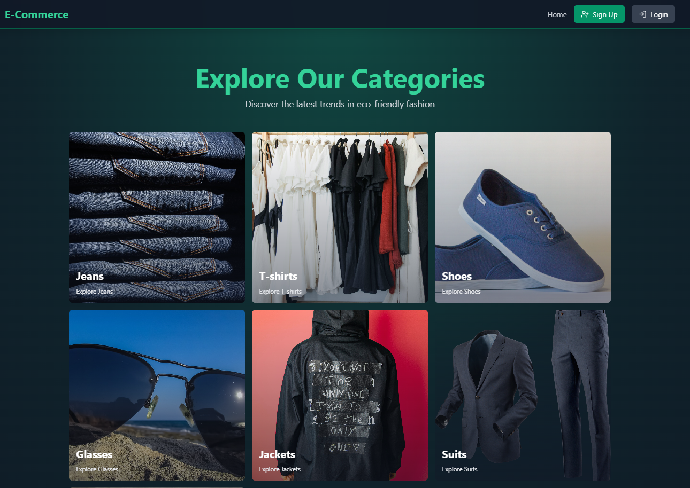
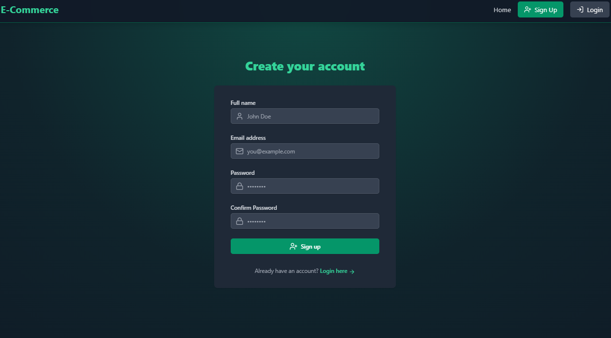
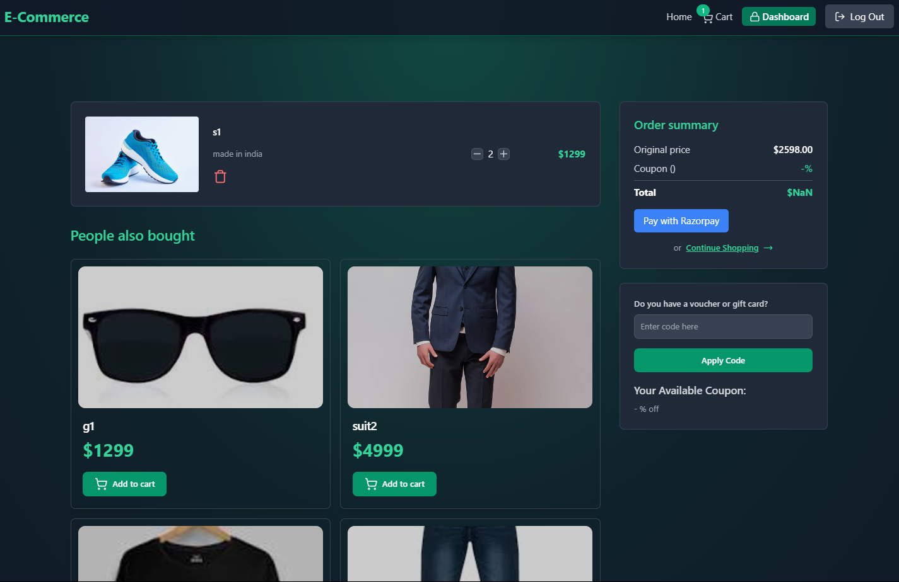

# About
A fully-featured e-commerce website designed with separate views for customers and admins, focusing on functionality, security, and performance optimization. The platform supports seamless shopping experiences and comprehensive admin tools for product and order management.

Link : https://eccomerce-web-app.onrender.com/  
"It may take a few extra seconds to load as it is deployed on a free plan on Render."

## Features

### Role-Based Access Control (RBAC)
- **Customer Features**:
  - Browse products, manage carts, place orders, and track deliveries.
- **Admin Features**:
  - Manage product inventory, view orders, and update order statuses.
- Secured routes using middleware for authentication and authorization.

### User Authentication and Authorization
- Integrated secure user login and registration with **JWT** for token-based authentication.
- Password encryption using **Bcrypt** for enhanced security.
- Optimized session handling with **Redis** for improved performance.

### Payment Gateway Integration
- **Razorpay**:
  - Enabled secure and seamless online payment processing.
  - Supported multiple payment methods: UPI, cards, net banking, and more.
  - Configured webhook support for handling payment success and failure events.

### RESTful API Development
- Designed efficient REST APIs using **Express.js** for robust backend operations.
- Managed the database with **MongoDB** and **Mongoose**, ensuring scalability and reliability.

### Media and File Management
- Integrated **Cloudinary** for optimized media storage and delivery.
- Efficiently handled product images for seamless user experience.

### Performance Optimization
- Implemented **Redis** for caching frequently accessed data.
- Enhanced response times for critical functionalities.

### Responsive User Interface
- Built a modern, user-friendly frontend using **React.js**.
- Styled with **Tailwind CSS** for clean and responsive design.
- Enhanced with **Framer Motion** for smooth animations and transitions.

---

## Tech Stack
- **Frontend:** React.js, Tailwind CSS, Axios
- **Backend:** Node.js, Express.js
- **Database:** MongoDB
- **Authentication:** JWT (JSON Web Token), Bcrypt.js
- **Payment Gateway:** Stripe SDK
- **Image Handling:** Cloudinary

## Setup .env file

- PORT=5000
- MONGO_URI=your_mongo_uri
- UPSTASH_REDIS_URL=your_redis_url

- ACCESS_TOKEN_SECRET=your_access_token_secret
- REFRESH_TOKEN_SECRET=your_refresh_token_secret

- CLOUDINARY_CLOUD_NAME=your_cloud_name
- CLOUDINARY_API_KEY=your_api_key
- CLOUDINARY_API_SECRET=your_api_secret
  
- RAZORPAY_API_KEY=key_id
-RAZORPAY_API_SECRET=key_secret
- CLIENT_URL=http://localhost:5173
- NODE_ENV=development

## Run this app locally
 npm run build
 
## Start the app
 npm run start
