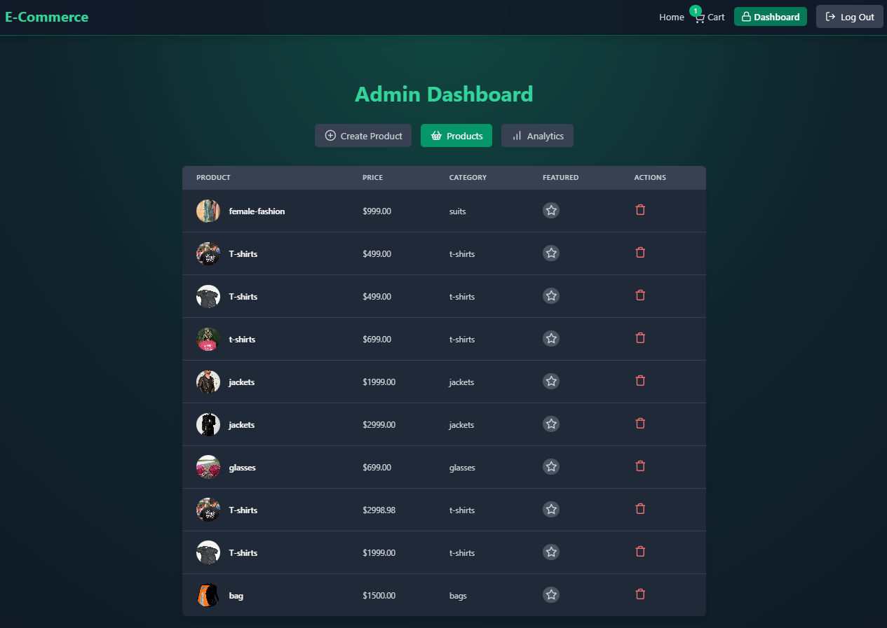

# About
A comprehensive e-commerce platform with distinct customer and admin interfaces, featuring user authentication, secure payment processing, product management, and a fully responsive design for seamless shopping across devices.

Link : https://eccomerce-web-app.onrender.com/  
"It may take a few extra seconds to load as it is deployed on a free plan on Render."

## Tech Stack

- **Frontend:** React.js, Tailwind CSS, Axios
- **Backend:** Node.js, Express.js
- **Database:** MongoDB
- **Authentication:** JWT (JSON Web Token), Bcrypt.js
- **Payment Gateway:** Stripe SDK
- **Image Handling:** Cloudinary

## Setup .env file

- PORT=5000
- MONGO_URI=your_mongo_uri
- UPSTASH_REDIS_URL=your_redis_url

- ACCESS_TOKEN_SECRET=your_access_token_secret
- REFRESH_TOKEN_SECRET=your_refresh_token_secret

- CLOUDINARY_CLOUD_NAME=your_cloud_name
- CLOUDINARY_API_KEY=your_api_key
- CLOUDINARY_API_SECRET=your_api_secret
  
- RAZORPAY_API_KEY=key_id
-RAZORPAY_API_SECRET=key_secret
- CLIENT_URL=http://localhost:5173
- NODE_ENV=development

## Run this app locally
 npm run build
 
## Start the app
 npm run start
